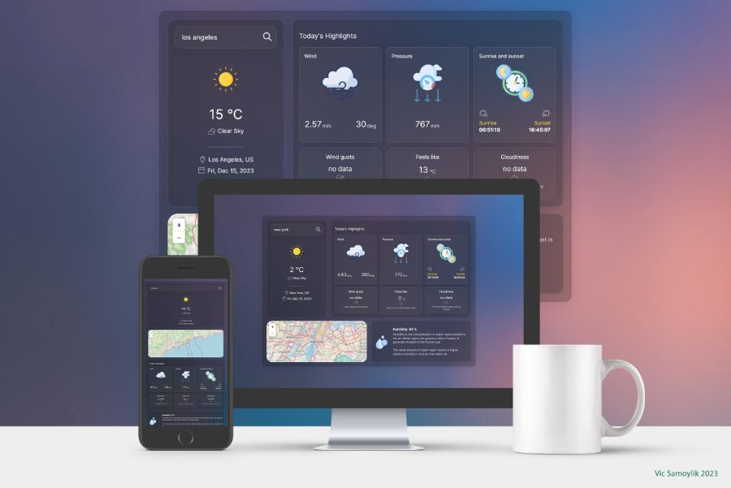

# weather-forecast-vue

This is simple VUE 3 Composition API + REST API weather SPA, based on youtube series [CosyFrontend](https://youtu.be/7ZMcIlZB85E). Huge thanks to the author of this screencast.



## Deployment

[vic-weather](https://vic-weather.netlify.app/)

## Changes and Improvments

- Instead of coordinats add Map component for better UI/UX
- Add LocalStorage logic to track and save user's last searched city
- Change design to glassmorphism
- Change some icons
- Fix layout issues
- Change some responsive and adaptive elements

## Technologies

- Vue 3 Composition API
- OpenWeather API

## Recommended IDE Setup

[VSCode](https://code.visualstudio.com/) + [Volar](https://marketplace.visualstudio.com/items?itemName=Vue.volar) (and disable Vetur) + [TypeScript Vue Plugin (Volar)](https://marketplace.visualstudio.com/items?itemName=Vue.vscode-typescript-vue-plugin).

## Project Setup

```sh
npm install
```

### Compile and Hot-Reload for Development

```sh
npm run dev
```

### Compile and Minify for Production

```sh
npm run build
```

### Preview build

```sh
npx vite preview
```
